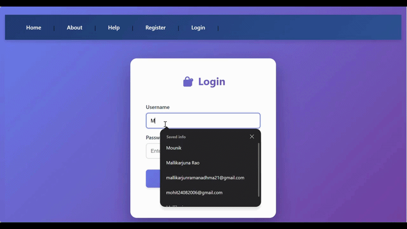
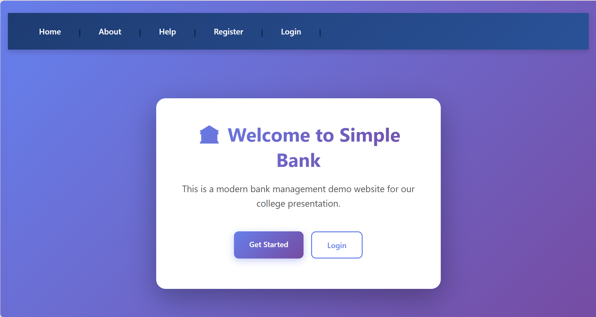
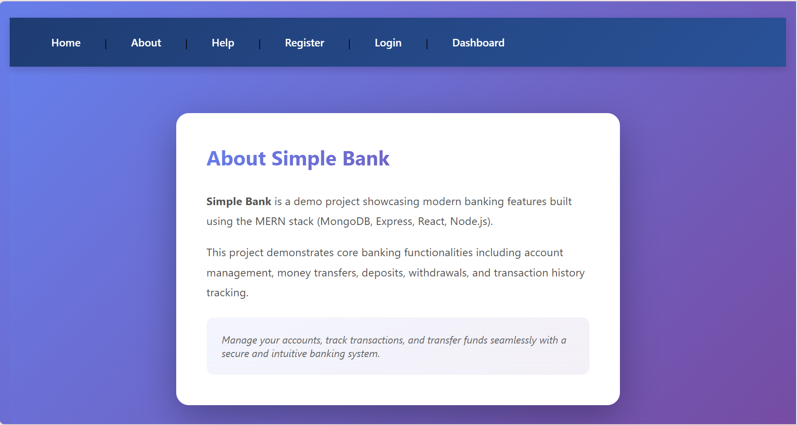
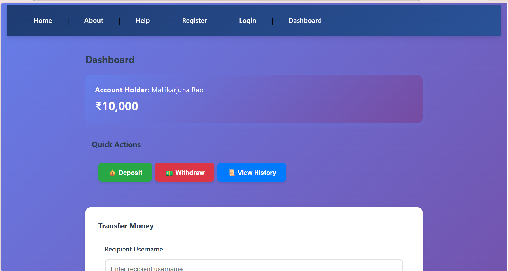
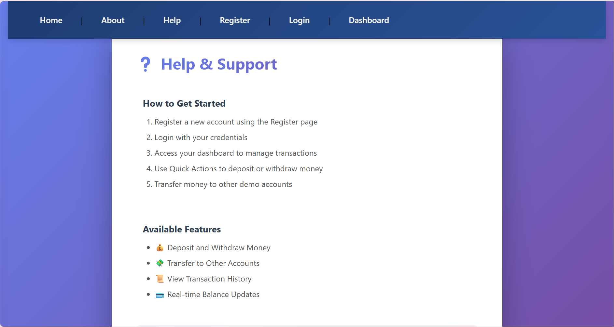

# Online Banking System

A full-stack banking application built using the MERN stack (MongoDB, Express, React, Node.js). This system allows users to securely manage accounts, transfer funds, and track transactions through a modern and responsive interface.

---

## Features

* Secure user authentication and authorization
* Account balance tracking
* Fund transfer between users
* Transaction history management
* Responsive and user-friendly UI
* RESTful backend APIs

---

## Tech Stack

Frontend: React, JavaScript, CSS
Backend: Node.js, Express.js
Database: MongoDB

---

## Demo



---

## Screenshots

### Login Page



### About Page



### Dashboard



### Help Page



---

## How to Run

### Backend

```bash
cd backend
npm install
npm start
```

### Frontend

```bash
cd frontend
npm install
npm run dev
```

Open in browser:
http://localhost:5173

---

## Environment Variables

Create a `.env` file in backend:

```env
MONGO_URI=your_mongodb_connection_string
PORT=5000
JWT_SECRET=your_secret_key
```

---

## Future Improvements

* Two-factor authentication
* Payment gateway integration
* Deployment (AWS / Render / Vercel)

---

## Team Members

## 👥 Team Members

- [Kshitij Satish Shetty](https://github.com/KshitijShetty27)  
- [Mallikarjuna Rao R.V.](https://github.com/mallikarjunrao-sketch)

